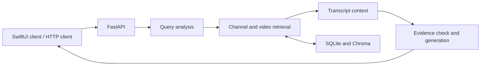

# Learning Agent

A personal learning assistant that answers questions using YouTube video transcripts and presents video sources with timestamps. Includes a Python API and a SwiftUI macOS client.

## Highlights

- Video and transcript ingestion with `yt-dlp`.
- Keyword and vector retrieval, followed by video reranking.
- Neighboring transcript chunks to preserve context.
- A bounded follow-up retrieval pass when evidence is incomplete.
- Token budgets for questions, conversation history, transcripts, and answers.
- Source links grouped by video and timestamp.
- Focused tests for retrieval boundaries, context selection, and request budgets.

## Architecture



The pipeline is in `backend/pipeline`; ingestion and persistence have separate modules. Groq serves the language model through an OpenAI-compatible client.

## Run the backend

Use Python 3.11+ with a compatible dependency environment. From the repository root:

```sh
python3 -m venv .venv
source .venv/bin/activate
python -m pip install -r backend/requirements.txt
cp backend/.env.example backend/.env
# Fill in your own configuration in backend/.env.
python -m uvicorn backend.api.server:app --host 127.0.0.1 --port 8000
```

Open `http://127.0.0.1:8000/docs` to add channels and use the API. The repository starts with an empty channel list; local indexes and databases are generated as you ingest content.

Configuration notes:

- `GROK_API_KEY` is the current variable name for a **Groq** key, not an xAI key.
- The current server requires a nonempty `YOUTUBE_API_KEY` even though the ingestion adapter uses `yt-dlp`.
- First use of embedding models may download model weights; provider requests require network access.

Example question after indexing suitable videos:

```sh
curl http://127.0.0.1:8000/ask \
  -H 'Content-Type: application/json' \
  -d '{"question":"Summarize the main ideas in the indexed videos","history":[]}'
```

## macOS client

Open `frontend/learning tool/learning tool.xcodeproj` in Xcode. The client uses AppKit and local process management, so it is a macOS application. Before using its server launcher, update `projectPath` and `pythonPath` in `ServerManager.swift` for your checkout. The API can also be used independently.

## Tests

```sh
python -m unittest discover -s tests -v
```

These regression tests use local fixtures and mocked model responses. They do not establish end-to-end answer accuracy; a curated retrieval and citation evaluation set remains future work.

## Current limitations

YouTube transcript availability and rate limits affect ingestion. Model answers may be incomplete or incorrect, so source links are provided for review. The local API has no production authentication or deployment configuration. Dependencies are not yet locked. The desktop launcher still needs per-machine paths.

## Author

Aviel Adika. Personal software project.
